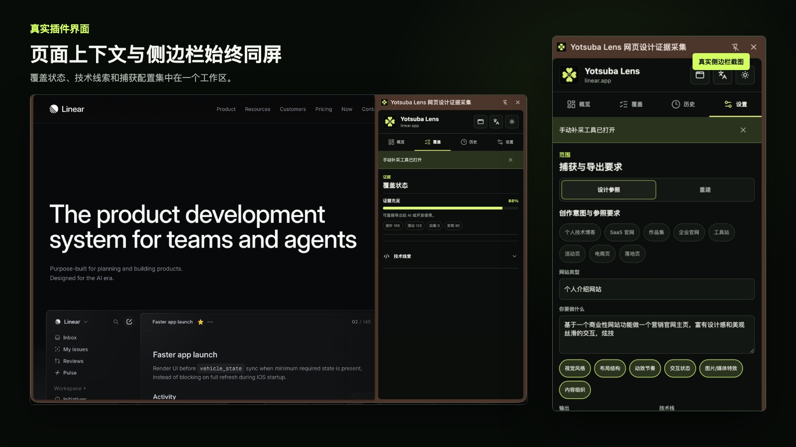
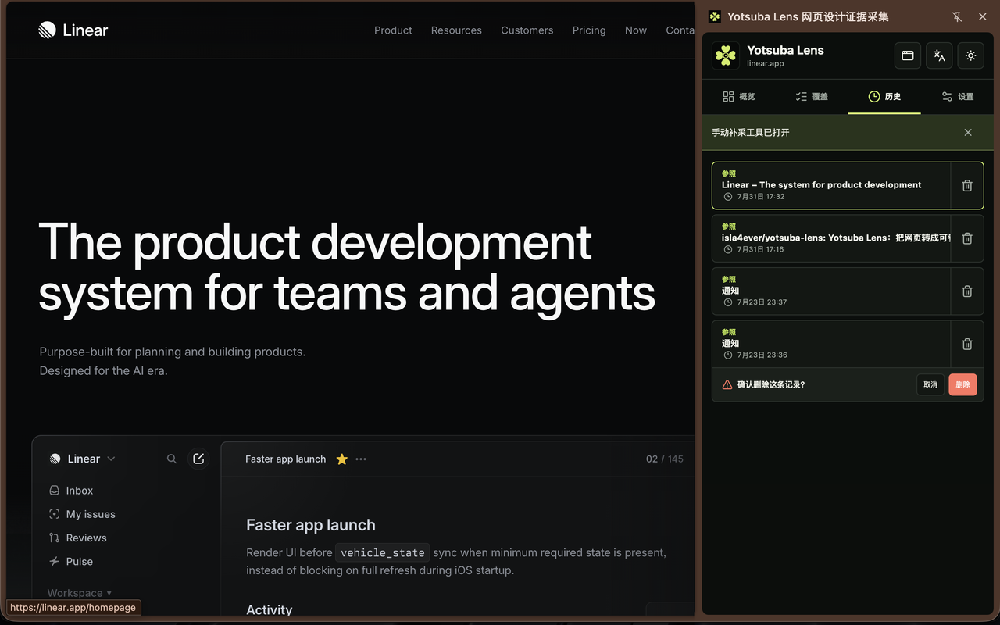
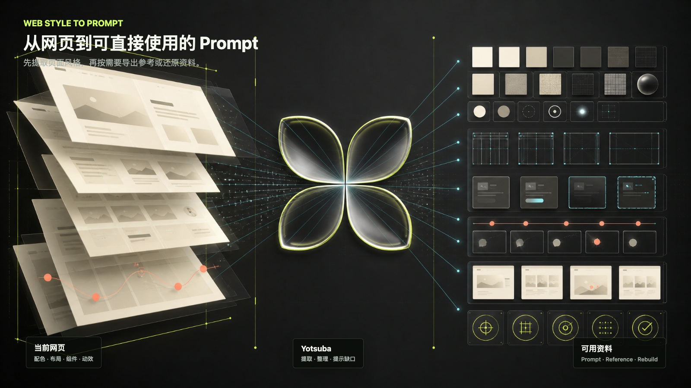

<p align="center">
  
</p>

<h1 align="center">Yotsuba 网页风格提取器</h1>
<p align="center"><strong>提取网页配色、布局、组件、交互和动效，生成可直接使用的 Prompt。</strong></p>

<p align="center">
  <a href="https://github.com/isla4ever/yotsuba-lens/actions/workflows/ci.yml"></a>
  
  
  
  <a href="LICENSE"></a>
</p>

<p align="center"><strong>中文</strong> · <a href="README.en.md">English</a></p>

<p align="center">
  
</p>

看到喜欢的网页，想参考它的配色、布局或交互，但不知道该怎样向编码工具描述？打开网页后运行一次智能捕获，Yotsuba 会整理页面风格、组件结构、交互状态和动效，并生成可直接使用的 Prompt 与参考资料。

```text
打开网页 → 智能捕获 → 查看风格与缺口 → 生成 Prompt / 参考包 → 开始实现
```

> [!IMPORTANT]
> `0.3.0` 已在 Chrome Web Store 发布；当前仓库正在准备名称与介绍更清晰的 `0.3.1` 更新。请只在你有权分析、参考或还原的页面上使用。

## 它能帮你做什么

| 你的需求 | Yotsuba 会做什么 | 你能得到什么 |
| --- | --- | --- |
| **参考一个网页的风格** | 提取配色、字体、间距、布局、组件和视觉效果 | 一份可迁移到新项目的风格参考 |
| **生成更准确的 Prompt** | 把页面特征整理成结构清晰的实现要求 | 可交给常见编码工具直接使用的 Prompt |
| **还原已获授权的页面** | 保存关键截图、尺寸、状态与检查要求 | 有明确范围的重建资料包，而不是一句“照着做” |
| **补齐悬停、展开等状态** | 自动指出缺少的页面状态，只让你补采必要部分 | 不需要从头录制整个浏览过程 |

## 真实工作区

<p align="center">
  
</p>

点击扩展图标默认打开侧边栏。概览、覆盖、历史和设置集中在同一工作区；快速弹窗只保留高频操作。捕获完成后可以直接查看已提取内容、缺少的状态和下一步任务。

<details>
  <summary><strong>查看历史记录与删除确认</strong></summary>
  <br />
  <p align="center">
    
  </p>
</details>

## 从网页到 Prompt 与参考资料

<p align="center">
  
</p>

生成的 Prompt 会引用实际提取到的页面特征；没有捕获到的状态会明确标记，不会凭空补全成“完整复刻”。

| 模式 | 适用目标 | 输出边界 |
| --- | --- | --- |
| **设计参照（Reference）** | 参考网页的配色、布局、组件、动效或交互，设计自己的页面 | 提取可复用的风格规律，不复制原站品牌、文案和素材 |
| **经授权重建（Rebuild）** | 对明确页面、尺寸和状态建立还原资料 | 只覆盖已经捕获的内容，缺少的状态会继续显示为待补充 |

## 核心能力

| 能力 | 实现边界 |
| --- | --- |
| **智能捕获与安全预算** | 基础捕获共享 15 秒预算；Rebuild 截图与 CDP 整理由独立超时和熔断保护，持续 mutation 与超大 DOM 可取消、可降级 |
| **引导式补采** | 自动归并最多 3 个滚动、悬停、焦点、展开或响应式任务；用户执行真实操作，插件只观察并保存目标状态 |
| **默认侧边栏** | 模式、捕获、覆盖、历史、配置与导出同屏；首次生成 AI 内容前提供配置指引 |
| **按需注入与权限分层** | 页面桥接只在用户操作后注入；标准版不含 `debugger`，深度 CDP 采集隔离在 Collector 构建 |
| **场景化验收** | Rebuild Pack 可驱动截图、像素、几何、动画进度与浏览器错误检查，不推测未采集行为 |

## 不只是截图转 Prompt

| 维度 | 常见截图式流程 | Yotsuba Lens |
| --- | --- | --- |
| 输入 | 单张或少量静态截图 | DOM、Token、几何、截图、事件、动效和运行时线索 |
| 交互状态 | 依赖人工描述或模型猜测 | 真实 hover、focus、scroll、open 与响应式场景证据 |
| 缺失信息 | 经常被补全成想象结果 | 明确记录为 `missing`、`partial` 或 `not-applicable` |
| 输出 | 一段通用 Prompt | Evidence Pack、AI Prompt Pack、Rebuild Draft Pack |
| 验收 | 靠肉眼判断“像不像” | 基于已捕获场景的可解释候选报告 |

## 工作流程

1. **打开页面**：进入普通 `http` 或 `https` 页面，点击 Yotsuba Lens，默认打开 Side Panel。
2. **选择目标**：Reference 用于原创设计参照；Rebuild 用于授权范围内的实现草稿。
3. **智能捕获**：自动完成基础证据采集，页面桥接只在此类用户操作后按需注入。
4. **检查缺口**：在 Side Panel 查看覆盖状态，只对关键缺口执行引导补采。
5. **整理项目**：可导入 Recorder 计划，或将最多 8 条同源路由加入 Rebuild 项目。
6. **导出与构建**：把证据包或 Prompt Pack 交给 AI Coding Agent。
7. **候选验收**：使用 Rebuild 验证器检查已有场景，不推测未捕获行为。

## 输出资料包

| 资料包 | 主要文件 | 用途 |
| --- | --- | --- |
| **Evidence-only Pack** | `README.md`、`skill.md`、`evidence.json` | 保存、分享或交给任意 AI 工具的结构化设计证据 |
| **AI Prompt Pack** | Evidence 文件、`ai-coding-prompt.md`、`ai-implementation-brief.md` | 使用 OpenAI 兼容模型生成面向目标项目的编码 Prompt |
| **Rebuild Draft Pack** | `capture-project-v2.json`、`scene-manifest.json`、`acceptance.json`、截图与受限 artifact | 保存授权重建基线、显式缺口和候选实现验收规则 |

## 安装

环境要求：Node.js `>=22.13.0`、npm `>=10`、Chrome 或其他 Chromium 浏览器。

### 标准版

```bash
npm ci
npm run build
```

打开 `chrome://extensions`，开启 **开发者模式**，点击 **加载已解压的扩展程序**，选择：

```text
<project-root>/.output/chrome-mv3
```

标准版不申请 Chrome `debugger` 权限，适合日常 Reference 和基础 Rebuild 捕获。

### Collector 版

```bash
npm run build:collector
```

加载 `<project-root>/.output/collector/chrome-mv3`。Collector 会额外申请 `debugger`，用于经授权的 DOMSnapshot、matched CSS、几何、视口和动画证据。Canvas 位图默认关闭，并受数量、像素和文件大小预算限制。

## Rebuild 候选验收

```bash
npm run verify:rebuild -- \
  --pack <rebuild-pack.zip> \
  --url http://localhost:3000
```

验证器只重放 `scene-manifest.json` 中已有证据的 initial、scroll、hover、focus 和 open 状态。输出包括 JSON/HTML 报告、候选截图、差异图和供 Agent 局部修复使用的上下文。

真实长页的捕获、候选实现和误差数据见 [AstroWind 自动重建实战](docs/astrowind-rebuild-benchmark.md) 与 [Bilibili 首页智能捕获与重建实战](docs/bilibili-rebuild-benchmark.md)。两个案例都保留失败项，并据此给出下一阶段优先级；Bilibili 案例还覆盖了高 mutation 页面下的恢复性与稳定节点验收。

## 隐私与权限

Yotsuba Lens 默认在本地处理和导出证据。只有用户配置模型 Key 并主动生成 AI 输出时，插件才发送压缩后的证据载荷；该载荷设计上排除原始 DOM、Cookie、本地存储、凭证、截图和未脱敏输入值。

| 权限 | 用途 |
| --- | --- |
| `activeTab`、`scripting` | 用户发起操作后，向当前页面按需注入桥接并执行采集 |
| `storage` | 在浏览器本地保存语言、主题、工作区元数据和可选 AI 配置 |
| `tabs`、`sidePanel` | 识别当前标签页并连接持久工作区 |
| `<all_urls>` | 允许用户在不同站点上发起捕获；不代表扩展会自动在所有页面运行 |
| `debugger` | 仅 Collector 构建包含，用于明确授权后的受限深度采集 |

本地 Rebuild 包可能包含页面可见文本、截图和脱敏后的 DOMSnapshot，应按敏感文件处理。完整边界见 [隐私与权限说明](docs/privacy.md)。

## 开发与质量门禁

```bash
npm run dev                 # 标准版开发服务器
npm run dev:collector       # Collector 开发服务器
npm run check:all           # TypeScript、101 项测试和两种生产构建
npm run check:browser       # 真实 MV3 注入、UI 对齐/溢出、20k/100k DOM 性能与恢复探针
npm run package:store       # 校验权限/版本并生成商店候选 ZIP 与 SHA256SUMS
```

浏览器门禁首次运行前执行：

```bash
npx playwright install chromium
```

## 项目结构

```text
entrypoints/        WXT background、content、popup 与 side panel 入口
src/analyzer/       页面结构、Token、交互与动效分析
src/capture-v2/     Rebuild 项目、CDP Collector、场景与验收契约
src/evidence/       证据包与摘要
src/generators/     Evidence、Prompt 与 Skill 生成器
src/overlay/        页面内选取和引导补采控制器
src/smart-capture/  智能捕获预算、编排和缺口任务
src/storage/        IndexedDB 工作区与 artifact 存储
scripts/            发布、压力探针和 Rebuild 验证工具
tests/              行为测试
docs/               架构、隐私、产品决策和验证记录
```

## 文档与贡献

- [架构说明](docs/architecture.md)
- [隐私与权限](docs/privacy.md)
- [验证记录](docs/validation.md)
- [AstroWind 自动重建实战](docs/astrowind-rebuild-benchmark.md)
- [Bilibili 首页智能捕获与重建实战](docs/bilibili-rebuild-benchmark.md)
- [变更记录](CHANGELOG.md)
- [参与贡献](CONTRIBUTING.md)
- [安全策略](SECURITY.md)
- [发布检查清单](docs/release-checklist.md)
- [Chrome Web Store 上架资料](docs/chrome-web-store-listing.md)

提交较大功能前请先创建 Issue。安全问题请通过 [GitHub Private Vulnerability Reporting](https://github.com/isla4ever/yotsuba-lens/security/advisories/new) 私下报告。

## License

[MIT](LICENSE) © Isla
